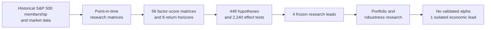
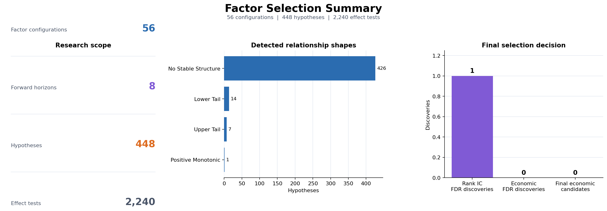
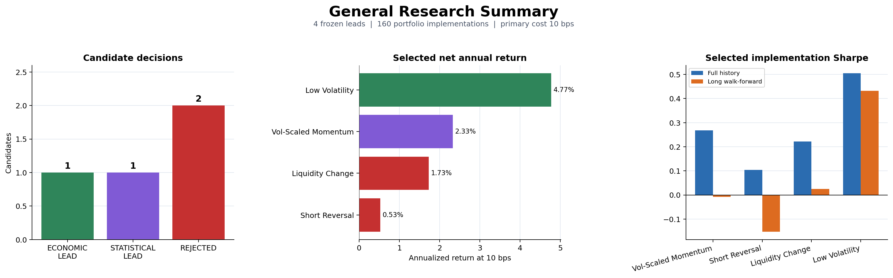

# Cross-Sectional Equity Factor Research

An end-to-end quantitative research project testing whether interpretable price-, return- and volume-based factors can explain cross-sectional differences in future returns among point-in-time S&P 500 constituents.

**Project status:** research completed.  
**Final conclusion:** no validated alpha was found.

[Read the complete Research Paper](<Research Paper.md>)


## TL;DR

The project evaluates 11 factor families, 56 parameter configurations and eight forward-return horizons. Their combination produces 448 factor-horizon hypotheses and 2,240 statistical and economic effect tests.

One Volatility-Scaled Momentum Rank-IC result survives global false-discovery-rate correction. However, no directly tradable quantile-return effect passes the complete Factor Selection rules.

The strongest portfolio-level result is a 60-day Low Volatility implementation. At the declared 10 bps transaction-cost assumption it produces a 4.77% net annualized return, a 0.505 full-history Sharpe ratio and a 0.432 long walk-forward Sharpe ratio. The result is not supported by a robust neighbouring parameter plateau and remains an `ISOLATED_RESULT`, not confirmed alpha.

The main output is therefore a reproducible factor-research framework, one economically interesting lead and a transparent negative conclusion.


## Research Question

Can information contained in historical prices, returns and trading volume rank S&P 500 stocks by their future relative performance?

The project does not forecast the direction of the complete market. On every date, it compares eligible stocks with other stocks in the index at that time and asks whether different factor scores lead to systematically different future returns.


## Research Pipeline



The five executable stages are:

1. **Data System** — reconstructs the historical universe and prepares audited market-data matrices.
2. **Factor Layer** — creates factor scores and forward-return matrices without selecting winners.
3. **Factor Selection Layer** — measures Rank IC, quantile-return shapes, time stability and multiple-testing-adjusted evidence.
4. **General Research** — converts four frozen leads into portfolio implementations with turnover, costs and risk diagnostics.
5. **Low Volatility Research** — tests whether the strongest lead is stable across neighbouring lookback windows.


## Research Scope

| Component | Scope |
| --- | ---: |
| Market-data period | 2008-01-02 to 2026-08-18 |
| Formal research start | 2010-01-01 |
| Trading dates | 4,686 |
| Historical ticker columns | 900 |
| Factor families | 11 |
| Factor configurations | 56 |
| Forward-return horizons | 8 |
| Factor-horizon hypotheses | 448 |
| Statistical and economic effect tests | 2,240 |

Observations from 2008–2009 are retained as warm-up history for long rolling calculations.


## Factor Universe

| Factor family | Configurations | Main idea |
| --- | ---: | --- |
| Momentum | 17 | Previous cumulative return with different formation and skip periods |
| Low Volatility | 7 | Preference for lower trailing return volatility |
| Trend | 6 | Price relative to a simple moving average |
| Short-Term Reversal | 3 | Reversal of recent relative performance |
| Residual Momentum | 3 | Momentum after removing the daily equal-weight market return |
| Volatility-Scaled Momentum | 3 | Momentum divided by trailing volatility |
| High Proximity | 3 | Price relative to its rolling high |
| Trend Slope | 4 | Rolling slope of log price |
| Risk-Adjusted Trend | 4 | Trend slope divided by annualized volatility |
| Liquidity Change | 3 | Short-term versus long-term dollar-volume change |
| Price-Volume Confirmation | 3 | Momentum adjusted by liquidity change |

The tested forward-return horizons are 1, 5, 10, 21, 42, 63, 126 and 252 trading days.


## Methodology

The principal safeguards are:

- point-in-time S&P 500 membership instead of the current constituent list;
- adjusted prices and compatible historical volume;
- separate price- and volume-quality masks;
- one-trading-day signal lag before measuring future returns or opening positions;
- cross-sectional Rank IC and ten-quantile return curves;
- separate monotonic, upper-tail, lower-tail and two-sided-tail tests;
- HAC-adjusted inference for serially dependent and overlapping observations;
- global Benjamini–Hochberg false-discovery-rate correction;
- frozen research leads before portfolio construction;
- transaction costs, turnover, beta exposure, calendar phases and walk-forward analysis;
- neighbouring-parameter analysis for the strongest economic result.

Winsorization is available in the implementation but disabled in the completed research. Verified extreme factor observations are not automatically removed.


## Factor Selection Result



| Result | Count |
| --- | ---: |
| Hypotheses without stable structure | 426 |
| Descriptive economic patterns | 22 |
| Time-unstable patterns | 10 |
| Patterns rejected by multiple testing | 12 |
| Rank-IC discoveries after global FDR | 1 |
| Economic discoveries after global FDR | 0 |
| Final economic candidates | 0 |

The surviving Rank-IC result belongs to `volatility_scaled_momentum|vsmom_12m_1m_vol60` at the one-day horizon. It provides statistical evidence about stock ordering, but its economic return spread is not sufficiently supported.


## Portfolio Research Result

Four leads were frozen for post-selection research:

- Volatility-Scaled Momentum 12m-1m / vol60;
- Short-Term Reversal 5d;
- Liquidity Change 20d/252d;
- Low Volatility 60d.

Short-Term Reversal and Liquidity Change were rejected. Volatility-Scaled Momentum remained a statistical lead. Low Volatility 60d became the strongest economic lead.



The selected Low Volatility implementation uses Q10 minus the middle quantiles, beta neutralization and a 63-trading-day rebalance frequency.

| Metric | Result |
| --- | ---: |
| Net annualized return at 10 bps | 4.77% |
| Full-history Sharpe | 0.505 |
| Maximum drawdown | -19.78% |
| Annualized turnover | 8.19x |
| Alpha HAC t-statistic | 1.60 |
| Long walk-forward Sharpe | 0.432 |


The 60-day result passes six of ten declared checks, but no Low Volatility window passes the complete statistical, cost, calendar-phase, walk-forward, regime and neighbouring-window requirements.


## Why This Is Not Validated Alpha

- No economic quantile-return effect survives the global multiple-testing correction.
- The strongest portfolio was selected after observing the same historical dataset.
- Its alpha HAC t-statistic is below the declared confirmation threshold.
- Neighbouring Low Volatility windows do not form a robust parameter plateau.
- Walk-forward periods are post-selection diagnostics, not a genuinely untouched final sample.
- Historical Yahoo Finance coverage remains incomplete for some old and delisted securities.

The project intentionally reports this negative conclusion instead of presenting the strongest historical backtest as a confirmed trading strategy.


## Quick Start

The completed environment was tested with Python 3.14 on Windows.

```powershell
git clone https://github.com/Ryhor-Karnatsevich/Cross-Sectional-Alpha-Modeling-and-Portfolio-Construction.git
cd "Cross-Sectional-Alpha-Modeling-and-Portfolio-Construction"

py -m venv .venv
.\.venv\Scripts\Activate.ps1
python -m pip install -r requirements.txt
```

Run the complete project:

```powershell
python src\Pipeline\run.py
```

The orchestrator executes all five stages in the required order and stops immediately if one stage fails. Existing compatible caches are reused.

Run one layer independently:

```powershell
python src\Data_System\pipeline.py
python src\Factors_Layer\pipeline.py
python src\Factor_Selection_Layer\pipeline.py
python src\Research_Layer\pipeline.py
python src\Research_Layer\Low_Volatility\pipeline.py
```

Run the automated tests:

```powershell
python -m unittest discover -s tests -v
```

The current test suite contains 43 tests.

The first complete run requires external downloads and the expensive creation of factor, quantile and portfolio caches. Runtime and data completeness depend on Yahoo Finance and the historical-membership source.


## Project Structure

```text
src/
├── Data_System/              historical universe, market data and audit
├── Factors_Layer/            factor and forward-return matrices
├── Factor_Selection_Layer/   quantile analysis and hypothesis selection
├── Research_Layer/           portfolio and robustness research
│   └── Low_Volatility/       focused neighbouring-window study
└── Pipeline/
    └── run.py                complete project orchestrator

Data/                         large reproducible datasets and caches
Results/                      reports, figures and compact result tables
tests/                        automated implementation checks
Research Paper.md             complete methodology and technical appendix
```

`Data` is excluded from Git because it contains large downloaded or reproducible files. Compact reports, figures, metadata and decision tables are stored in `Results`.


## Main Outputs

| Layer | Main report | Main figure |
| --- | --- | --- |
| Data System | `Results/Data_System/data_audit_report.md` | `Results/Data_System/Figures/data_audit_summary.png` |
| Factor Layer | `Results/Factors_Layer/factor_layer_report.md` | `Results/Factors_Layer/Figures/factor_layer_summary.png` |
| Factor Selection | `Results/Factor_Selection_Layer/factor_selection_report.md` | `Results/Factor_Selection_Layer/Figures/factor_selection_summary.png` |
| General Research | `Results/Research_Layer/General/research_report.md` | `Results/Research_Layer/General/Figures/general_research_summary.png` |
| Low Volatility Research | `Results/Research_Layer/Low_Volatility/low_volatility_report.md` | `Results/Research_Layer/Low_Volatility/Figures/low_volatility_summary.png` |


## Limitations

- Historical index membership comes from a community-maintained dataset rather than official S&P point-in-time data.
- Missing Yahoo Finance history means survivorship and data-availability bias are reduced but not eliminated.
- Point-in-time sector classifications are unavailable, so sector exposure is reported as `NOT_AVAILABLE`.
- Fixed transaction costs do not model nonlinear market impact, capacity, borrow fees or short availability.
- The same historical dataset influenced factor discovery and follow-up portfolio research.
- The factor universe contains price-, return- and volume-based signals but no fundamental or alternative data.


## Documentation

The [Research Paper](<Research Paper.md>) contains the complete economic motivation, hypotheses, data construction, formulas, experimental design, results, limitations, references and function-level Technical Appendix.

This repository is a research and educational project. It is not investment advice and does not represent a production-ready trading strategy.
