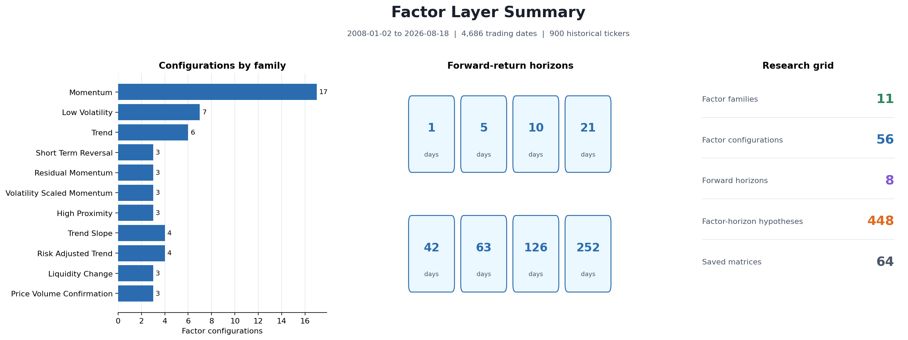

# Factor Layer Report

## Build Snapshot

| Metric | Result |
| --- | ---: |
| Equity period | 2008-01-02 to 2026-08-18 |
| Trading dates | 4,686 |
| Historical ticker columns | 900 |
| Factor families | 11 |
| Factor configurations | 56 |
| Forward-return horizons | 8 |
| Factor-horizon hypotheses | 448 |
| Winsorization applied | no |
| Factor cache reused | yes |

## Factor Families

| Factor family | Configurations | Variants |
| --- | ---: | --- |
| Momentum | 17 | 3m-0m, 3m-1m, 6m-0m, 6m-1m, 6m-2m, 9m-0m, 9m-1m, 9m-2m, 12m-0m, 12m-1m, 12m-2m, 18m-0m, 18m-1m, 18m-2m, 24m-0m, 24m-1m, 24m-2m |
| Low Volatility | 7 | 20d, 40d, 60d, 90d, 120d, 180d, 252d |
| Trend | 6 | SMA20, SMA50, SMA100, SMA150, SMA200, SMA250 |
| Short Term Reversal | 3 | reversal_5d, reversal_10d, reversal_21d |
| Residual Momentum | 3 | resmom_6m_1m, resmom_9m_1m, resmom_12m_1m |
| Volatility Scaled Momentum | 3 | vsmom_6m_1m_vol60, vsmom_9m_1m_vol60, vsmom_12m_1m_vol60 |
| High Proximity | 3 | high_6m, high_12m, high_18m |
| Trend Slope | 4 | slope_50d, slope_100d, slope_200d, slope_250d |
| Risk Adjusted Trend | 4 | risk_trend_50d, risk_trend_100d, risk_trend_200d, risk_trend_250d |
| Liquidity Change | 3 | liq_5d_60d, liq_20d_126d, liq_20d_252d |
| Price Volume Confirmation | 3 | pvc_6m_1m_liq5_60, pvc_9m_1m_liq20_126, pvc_12m_1m_liq20_252 |

## Complete Factor Configurations

| # | Factor family | Variant | Parameters |
| ---: | --- | --- | --- |
| 1 | Momentum | 3m-0m | `{"skip": 0, "window": 63}` |
| 2 | Momentum | 3m-1m | `{"skip": 21, "window": 63}` |
| 3 | Momentum | 6m-0m | `{"skip": 0, "window": 126}` |
| 4 | Momentum | 6m-1m | `{"skip": 21, "window": 126}` |
| 5 | Momentum | 6m-2m | `{"skip": 42, "window": 126}` |
| 6 | Momentum | 9m-0m | `{"skip": 0, "window": 189}` |
| 7 | Momentum | 9m-1m | `{"skip": 21, "window": 189}` |
| 8 | Momentum | 9m-2m | `{"skip": 42, "window": 189}` |
| 9 | Momentum | 12m-0m | `{"skip": 0, "window": 252}` |
| 10 | Momentum | 12m-1m | `{"skip": 21, "window": 252}` |
| 11 | Momentum | 12m-2m | `{"skip": 42, "window": 252}` |
| 12 | Momentum | 18m-0m | `{"skip": 0, "window": 378}` |
| 13 | Momentum | 18m-1m | `{"skip": 21, "window": 378}` |
| 14 | Momentum | 18m-2m | `{"skip": 42, "window": 378}` |
| 15 | Momentum | 24m-0m | `{"skip": 0, "window": 504}` |
| 16 | Momentum | 24m-1m | `{"skip": 21, "window": 504}` |
| 17 | Momentum | 24m-2m | `{"skip": 42, "window": 504}` |
| 18 | Low Volatility | 20d | `{"window": 20}` |
| 19 | Low Volatility | 40d | `{"window": 40}` |
| 20 | Low Volatility | 60d | `{"window": 60}` |
| 21 | Low Volatility | 90d | `{"window": 90}` |
| 22 | Low Volatility | 120d | `{"window": 120}` |
| 23 | Low Volatility | 180d | `{"window": 180}` |
| 24 | Low Volatility | 252d | `{"window": 252}` |
| 25 | Trend | SMA20 | `{"window": 20}` |
| 26 | Trend | SMA50 | `{"window": 50}` |
| 27 | Trend | SMA100 | `{"window": 100}` |
| 28 | Trend | SMA150 | `{"window": 150}` |
| 29 | Trend | SMA200 | `{"window": 200}` |
| 30 | Trend | SMA250 | `{"window": 250}` |
| 31 | Short Term Reversal | reversal_5d | `{"window": 5}` |
| 32 | Short Term Reversal | reversal_10d | `{"window": 10}` |
| 33 | Short Term Reversal | reversal_21d | `{"window": 21}` |
| 34 | Residual Momentum | resmom_6m_1m | `{"skip": 21, "window": 126}` |
| 35 | Residual Momentum | resmom_9m_1m | `{"skip": 21, "window": 189}` |
| 36 | Residual Momentum | resmom_12m_1m | `{"skip": 21, "window": 252}` |
| 37 | Volatility Scaled Momentum | vsmom_6m_1m_vol60 | `{"skip": 21, "volatility_window": 60, "window": 126}` |
| 38 | Volatility Scaled Momentum | vsmom_9m_1m_vol60 | `{"skip": 21, "volatility_window": 60, "window": 189}` |
| 39 | Volatility Scaled Momentum | vsmom_12m_1m_vol60 | `{"skip": 21, "volatility_window": 60, "window": 252}` |
| 40 | High Proximity | high_6m | `{"window": 126}` |
| 41 | High Proximity | high_12m | `{"window": 252}` |
| 42 | High Proximity | high_18m | `{"window": 378}` |
| 43 | Trend Slope | slope_50d | `{"window": 50}` |
| 44 | Trend Slope | slope_100d | `{"window": 100}` |
| 45 | Trend Slope | slope_200d | `{"window": 200}` |
| 46 | Trend Slope | slope_250d | `{"window": 250}` |
| 47 | Risk Adjusted Trend | risk_trend_50d | `{"window": 50}` |
| 48 | Risk Adjusted Trend | risk_trend_100d | `{"window": 100}` |
| 49 | Risk Adjusted Trend | risk_trend_200d | `{"window": 200}` |
| 50 | Risk Adjusted Trend | risk_trend_250d | `{"window": 250}` |
| 51 | Liquidity Change | liq_5d_60d | `{"long_window": 60, "short_window": 5}` |
| 52 | Liquidity Change | liq_20d_126d | `{"long_window": 126, "short_window": 20}` |
| 53 | Liquidity Change | liq_20d_252d | `{"long_window": 252, "short_window": 20}` |
| 54 | Price Volume Confirmation | pvc_6m_1m_liq5_60 | `{"confirmation_strength": 0.25, "liquidity_clip": 2, "long_window": 60, "short_window": 5, "skip": 21, "window": 126}` |
| 55 | Price Volume Confirmation | pvc_9m_1m_liq20_126 | `{"confirmation_strength": 0.25, "liquidity_clip": 2, "long_window": 126, "short_window": 20, "skip": 21, "window": 189}` |
| 56 | Price Volume Confirmation | pvc_12m_1m_liq20_252 | `{"confirmation_strength": 0.25, "liquidity_clip": 2, "long_window": 252, "short_window": 20, "skip": 21, "window": 252}` |

## Forward-Return Horizons

`1`, `5`, `10`, `21`, `42`, `63`, `126`, `252` trading days.

## Interpretation

This report describes the complete Factor Layer research grid. It confirms which factor variants and forward-return horizons were created, but it does not evaluate whether any factor predicts returns or produces alpha.
