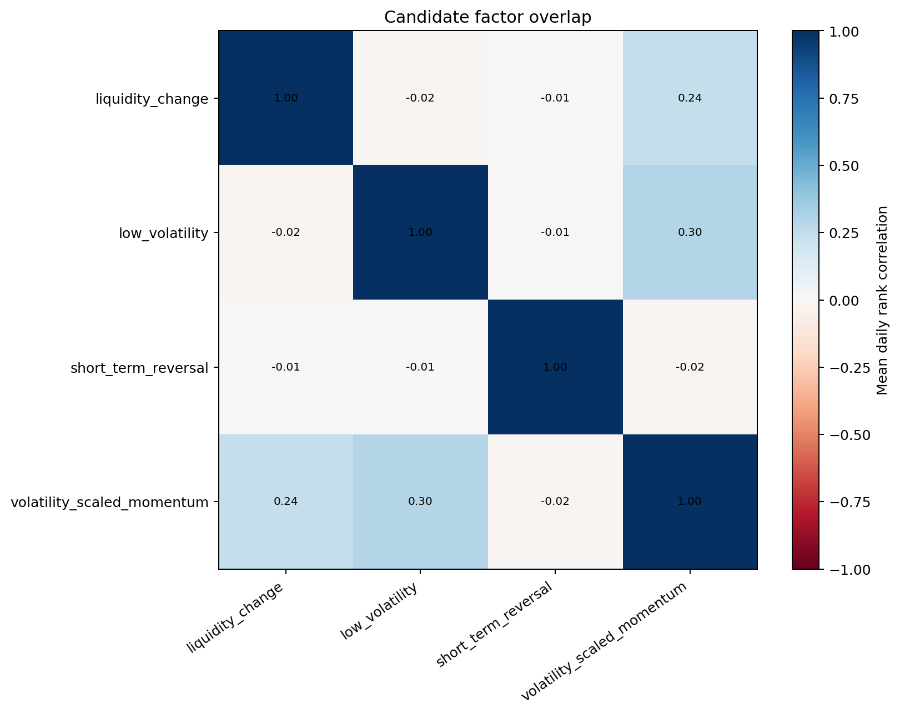
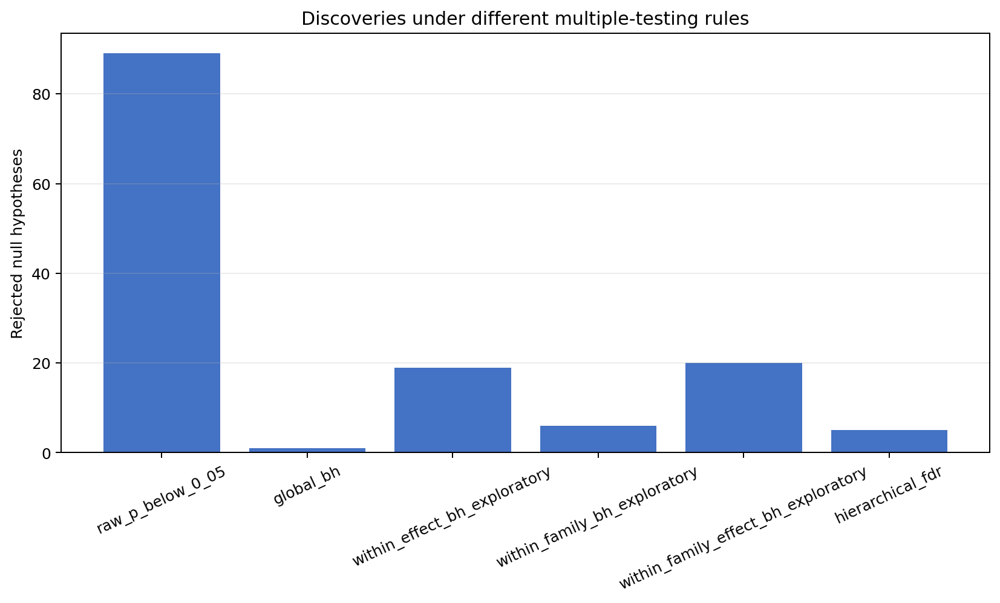
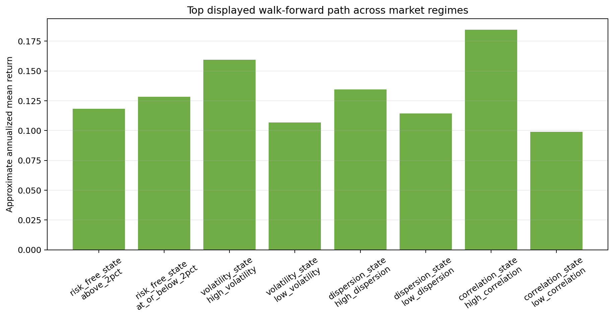
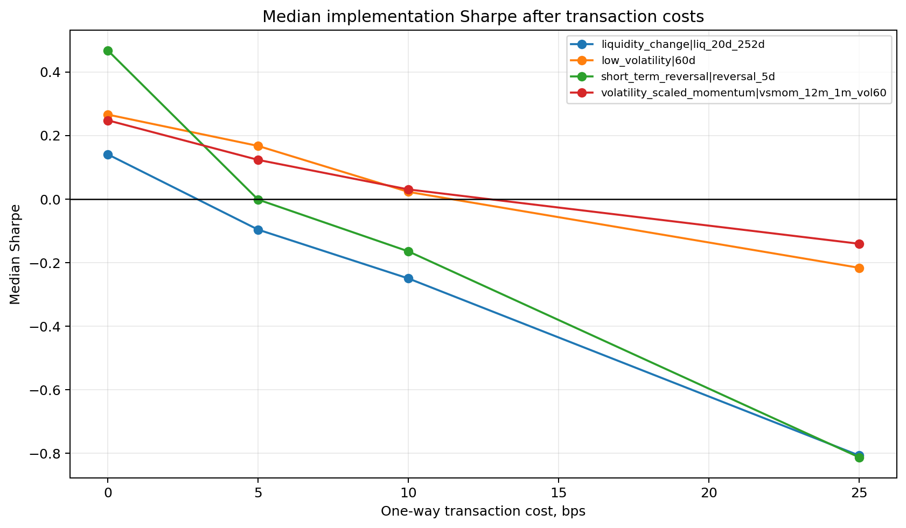
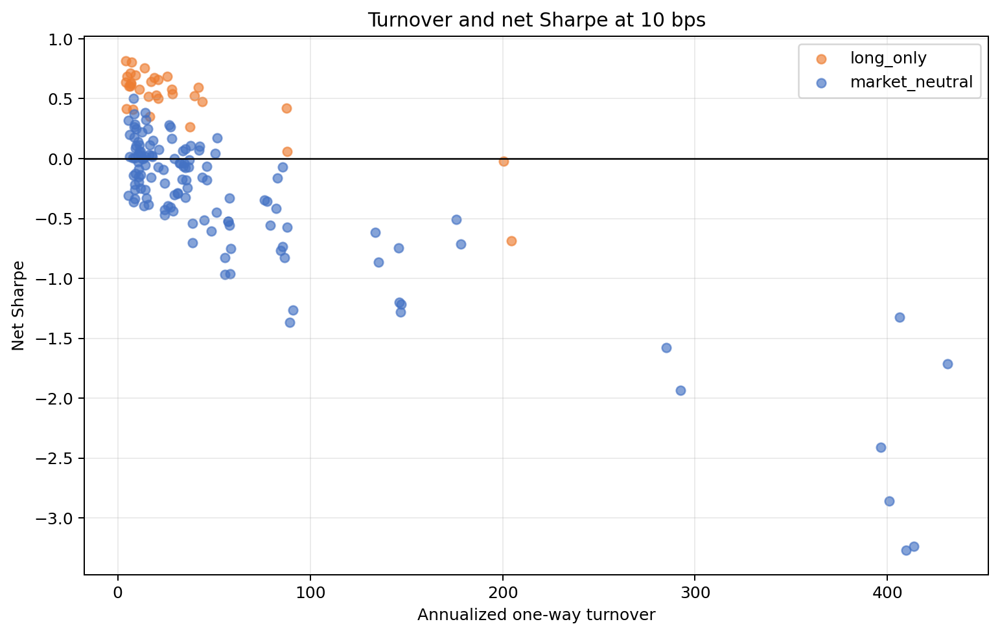
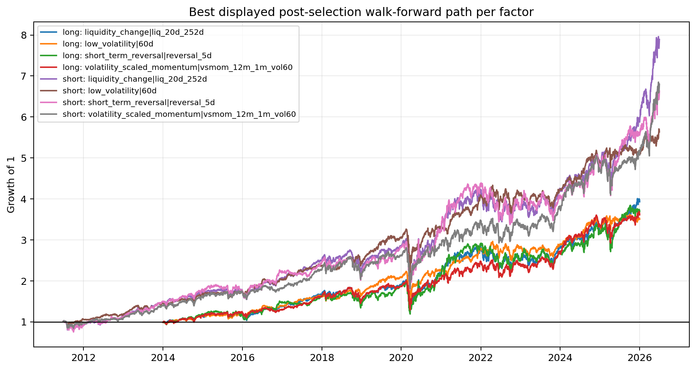

# Research Layer Report

## Scope

- Frozen factor leads: `4`.
- Portfolio implementations: `160`.
- Transaction-cost assumptions: `[0, 5, 10, 25]` bps.
- Primary reporting cost: `10` bps.
- Walk-forward status: post-selection historical simulation, not a genuinely untouched final test.

## Frozen Candidates

| factor_key | selection_horizon | selection_evidence | selection_pattern | selection_status |
| --- | --- | --- | --- | --- |
| volatility_scaled_momentum\|vsmom_12m_1m_vol60 | 1.0000 | global_fdr_rank_signal | no_stable_structure | no_stable_structure |
| short_term_reversal\|reversal_5d | 5.0000 | upper_tail_exploratory_lead | upper_tail | rejected_by_multiple_testing |
| liquidity_change\|liq_20d_252d | 252.0000 | upper_tail_exploratory_lead | upper_tail | rejected_by_multiple_testing |
| low_volatility\|60d | 63.0000 | lower_tail_exploratory_lead | lower_tail | rejected_by_multiple_testing |

## Final Candidate Decisions

The labels apply the declared statistical and economic rules. `VALIDATED_ALPHA` is intentionally unavailable because no untouched final sample remains after candidate discovery.

| factor_key | final_status | best_method | best_rebalance_days | best_net_annualized_return | best_net_sharpe | best_alpha_hac_tstat | best_long_wf_sharpe |
| --- | --- | --- | --- | --- | --- | --- | --- |
| volatility_scaled_momentum\|vsmom_12m_1m_vol60 | STATISTICAL_LEAD | middle_minus_q1 | 63.0000 | 0.0233 | 0.2676 | 1.3171 | -0.0076 |
| short_term_reversal\|reversal_5d | REJECTED | q10_minus_q1 | 21.0000 | 0.0053 | 0.1034 | 0.2609 | -0.1521 |
| liquidity_change\|liq_20d_252d | REJECTED | q10_minus_q1 | 63.0000 | 0.0173 | 0.2218 | 0.8715 | 0.0252 |
| low_volatility\|60d | ECONOMIC_LEAD | q10_minus_middle | 63.0000 | 0.0477 | 0.5050 | 1.6033 | 0.4317 |

## Benchmarks

| benchmark | annualized_return | annualized_volatility | sharpe | maximum_drawdown |
| --- | --- | --- | --- | --- |
| equal_weight_market | 0.1412 | 0.1812 | 0.7382 | -0.3990 |
| risk_free | 0.0150 | 0.0012 |  | 0.0000 |

## Multiple Testing Sensitivity

Global FDR remains the original confirmatory result. Within-group values are reported as sensitivity diagnostics and do not replace it after seeing the data.

| method | rejections | economic_rejections | ic_rejections | interpretation |
| --- | --- | --- | --- | --- |
| raw_p_below_0_05 | 89.0000 | 37.0000 | 52.0000 | exploratory |
| global_bh | 1.0000 | 0.0000 | 1.0000 | confirmatory |
| within_effect_bh_exploratory | 19.0000 | 0.0000 | 19.0000 | exploratory |
| within_family_bh_exploratory | 6.0000 | 0.0000 | 6.0000 | exploratory |
| within_family_effect_bh_exploratory | 20.0000 | 0.0000 | 20.0000 | exploratory |
| hierarchical_fdr | 5.0000 | 0.0000 | 5.0000 | structured_sensitivity |

## Candidate Factor Overlap

Daily cross-sectional rank correlation shows whether two candidate formulas mostly encode the same stock ordering.

| factor_left | factor_right | mean_daily_rank_correlation | mean_absolute_daily_rank_correlation | high_absolute_overlap_rate |
| --- | --- | --- | --- | --- |
| volatility_scaled_momentum\|vsmom_12m_1m_vol60 | low_volatility\|60d | 0.2961 | 0.3113 | 0.0000 |
| volatility_scaled_momentum\|vsmom_12m_1m_vol60 | liquidity_change\|liq_20d_252d | 0.2381 | 0.2387 | 0.0000 |
| short_term_reversal\|reversal_5d | low_volatility\|60d | -0.0058 | 0.2219 | 0.0000 |
| volatility_scaled_momentum\|vsmom_12m_1m_vol60 | short_term_reversal\|reversal_5d | -0.0166 | 0.1760 | 0.0000 |
| liquidity_change\|liq_20d_252d | low_volatility\|60d | -0.0224 | 0.1111 | 0.0000 |
| short_term_reversal\|reversal_5d | liquidity_change\|liq_20d_252d | -0.0067 | 0.0851 | 0.0000 |

## Full-History Portfolio Implementations

These results are descriptive because both candidates and implementations are visible on the same historical sample.

| factor_key | method | beta_neutral | rebalance_days | annualized_return | sharpe | maximum_drawdown | annualized_turnover | alpha_hac_tstat |
| --- | --- | --- | --- | --- | --- | --- | --- | --- |
| low_volatility\|60d | long_q10 | False | 63.0000 | 0.1220 | 0.8176 | -0.3296 | 4.2047 | 1.5213 |
| low_volatility\|60d | long_q10 | False | 21.0000 | 0.1185 | 0.8029 | -0.3189 | 7.3102 | 1.4345 |
| low_volatility\|60d | long_q10 | False | 5.0000 | 0.1103 | 0.7557 | -0.3010 | 13.8495 | 1.1600 |
| liquidity_change\|liq_20d_252d | long_q10 | False | 63.0000 | 0.1417 | 0.7153 | -0.3840 | 6.3658 | 0.3441 |
| volatility_scaled_momentum\|vsmom_12m_1m_vol60 | long_q10 | False | 21.0000 | 0.1333 | 0.6962 | -0.3578 | 9.2486 | 0.6615 |
| low_volatility\|60d | long_q10 | False | 1.0000 | 0.0998 | 0.6841 | -0.3021 | 25.8684 | 0.7053 |
| volatility_scaled_momentum\|vsmom_12m_1m_vol60 | long_q10 | False | 63.0000 | 0.1312 | 0.6840 | -0.3545 | 4.9314 | 0.4789 |
| volatility_scaled_momentum\|vsmom_12m_1m_vol60 | long_q10 | False | 5.0000 | 0.1285 | 0.6738 | -0.3596 | 19.0497 | 0.5273 |
| short_term_reversal\|reversal_5d | long_q10 | False | 21.0000 | 0.1481 | 0.6619 | -0.4723 | 20.9923 | -0.3727 |
| liquidity_change\|liq_20d_252d | long_q10 | False | 21.0000 | 0.1270 | 0.6405 | -0.3962 | 17.3998 | -0.4972 |
| low_volatility\|60d | long_q1 | False | 63.0000 | 0.1699 | 0.6403 | -0.4900 | 4.0783 | -0.1633 |
| short_term_reversal\|reversal_5d | long_q1 | False | 63.0000 | 0.1300 | 0.6349 | -0.3943 | 6.9773 | -0.6264 |
| short_term_reversal\|reversal_5d | long_q10 | False | 63.0000 | 0.1326 | 0.6216 | -0.4468 | 6.9641 | -1.0228 |
| liquidity_change\|liq_20d_252d | long_q1 | False | 63.0000 | 0.1254 | 0.6068 | -0.4327 | 5.8102 | -1.5084 |
| low_volatility\|60d | long_q1 | False | 21.0000 | 0.1631 | 0.6054 | -0.5346 | 6.4288 | -0.5200 |

## Walk-Forward Behaviour

Each implementation is kept fixed. Only the sign of a market-neutral spread is chosen inside either the preceding 18-month or four-year training window and then applied to the following six- or twelve-month OOS period. No implementation winner is silently removed from the output.

| factor_key | method | beta_neutral | rebalance_days | complete_oos_periods | positive_oos_period_rate | stitched_oos_annualized_return | stitched_oos_sharpe | orientation_changes |
| --- | --- | --- | --- | --- | --- | --- | --- | --- |
| low_volatility\|60d | long_q10 | False | 63.0000 | 30.0000 | 0.9333 | 0.1225 | 0.7975 | 0.0000 |
| low_volatility\|60d | long_q10 | False | 21.0000 | 30.0000 | 0.8667 | 0.1185 | 0.7817 | 0.0000 |
| liquidity_change\|liq_20d_252d | long_q10 | False | 63.0000 | 30.0000 | 0.8667 | 0.1481 | 0.7425 | 0.0000 |
| low_volatility\|60d | long_q10 | False | 5.0000 | 30.0000 | 0.8333 | 0.1105 | 0.7371 | 0.0000 |
| volatility_scaled_momentum\|vsmom_12m_1m_vol60 | long_q10 | False | 63.0000 | 30.0000 | 0.8333 | 0.1367 | 0.7073 | 0.0000 |
| low_volatility\|60d | long_q10 | False | 63.0000 | 12.0000 | 1.0000 | 0.1104 | 0.6828 | 0.0000 |
| volatility_scaled_momentum\|vsmom_12m_1m_vol60 | long_q10 | False | 21.0000 | 30.0000 | 0.8333 | 0.1308 | 0.6789 | 0.0000 |
| liquidity_change\|liq_20d_252d | long_q10 | False | 21.0000 | 30.0000 | 0.8333 | 0.1328 | 0.6653 | 0.0000 |
| low_volatility\|60d | long_q10 | False | 1.0000 | 30.0000 | 0.8333 | 0.0991 | 0.6609 | 0.0000 |
| volatility_scaled_momentum\|vsmom_12m_1m_vol60 | long_q10 | False | 5.0000 | 30.0000 | 0.8333 | 0.1268 | 0.6606 | 0.0000 |
| low_volatility\|60d | long_q10 | False | 21.0000 | 12.0000 | 1.0000 | 0.1049 | 0.6555 | 0.0000 |
| low_volatility\|60d | long_q1 | False | 63.0000 | 30.0000 | 0.8000 | 0.1762 | 0.6532 | 0.0000 |
| short_term_reversal\|reversal_5d | long_q1 | False | 63.0000 | 30.0000 | 0.8000 | 0.1348 | 0.6484 | 0.0000 |
| low_volatility\|60d | long_q1 | False | 21.0000 | 30.0000 | 0.8000 | 0.1676 | 0.6128 | 0.0000 |
| low_volatility\|60d | long_q10 | False | 5.0000 | 12.0000 | 1.0000 | 0.0972 | 0.6128 | 0.0000 |

## Risk and Data Diagnostics

- Sector exposure status: `NOT_AVAILABLE` — Data System has no point-in-time sector_history.csv. Historical sector exposure was not estimated.
- Missing returns held by a portfolio are reported as unpriced weight; they are never silently presented as verified zero returns.
- Beta-neutralization uses trailing 252-day betas shifted by one day.
- Long-only Sharpe is calculated over the risk-free rate. Market-neutral Sharpe uses the self-financing spread return convention.

| factor_key | method | beta_neutral | rebalance_days | average_estimated_beta | maximum_absolute_estimated_beta | average_gross_exposure | average_net_exposure | maximum_position_weight | maximum_unpriced_weight |
| --- | --- | --- | --- | --- | --- | --- | --- | --- | --- |
| low_volatility\|60d | q10_minus_q1 | False | 63.0000 | -0.9082 | 4.4024 | 2.0648 | -0.0110 | 0.1334 | 0.0235 |
| low_volatility\|60d | middle_minus_q1 | False | 63.0000 | -0.4675 | 2.3838 | 2.0510 | -0.0042 | 0.1032 | 0.0065 |
| low_volatility\|60d | q10_minus_q1 | False | 21.0000 | -0.8623 | 1.9102 | 2.0145 | -0.0013 | 0.0586 | 0.0228 |
| short_term_reversal\|reversal_5d | long_q1 | False | 1.0000 | 1.0956 | 1.8988 | 1.0000 | 1.0000 | 0.0303 | 0.0000 |
| short_term_reversal\|reversal_5d | long_q10 | False | 1.0000 | 1.0823 | 1.8524 | 1.0000 | 1.0000 | 0.0294 | 0.0000 |
| low_volatility\|60d | long_q1 | False | 1.0000 | 1.4284 | 1.8250 | 1.0000 | 1.0000 | 0.0303 | 0.0000 |
| low_volatility\|60d | long_q1 | False | 5.0000 | 1.4275 | 1.8107 | 0.9988 | 0.9988 | 0.0405 | 0.0000 |
| short_term_reversal\|reversal_5d | long_q1 | False | 5.0000 | 1.0932 | 1.8048 | 0.9993 | 0.9993 | 0.0352 | 0.0156 |
| low_volatility\|60d | long_q1 | False | 63.0000 | 1.4137 | 1.8022 | 0.9844 | 0.9844 | 0.0538 | 0.0000 |
| low_volatility\|60d | long_q1 | False | 21.0000 | 1.4239 | 1.7878 | 0.9943 | 0.9943 | 0.0468 | 0.0000 |

## Calendar-Phase Stability

| path_key | phase_count | phase_sharpe_mean | phase_sharpe_min | phase_sharpe_max | phase_sharpe_std |
| --- | --- | --- | --- | --- | --- |
| low_volatility\|60d\|long_q10\|unconstrained_beta\|r63\|ensemble | 3.0000 | 0.9211 | 0.9058 | 0.9500 | 0.0205 |
| low_volatility\|60d\|long_q10\|unconstrained_beta\|r21\|ensemble | 3.0000 | 0.9123 | 0.9040 | 0.9242 | 0.0086 |
| low_volatility\|60d\|long_q10\|unconstrained_beta\|r5\|ensemble | 3.0000 | 0.8684 | 0.8266 | 0.8951 | 0.0299 |
| low_volatility\|60d\|long_q10\|unconstrained_beta\|r1\|ensemble | 1.0000 | 0.7991 | 0.7991 | 0.7991 | 0.0000 |
| liquidity_change\|liq_20d_252d\|long_q10\|unconstrained_beta\|r63\|ensemble | 3.0000 | 0.7834 | 0.7457 | 0.8099 | 0.0274 |
| volatility_scaled_momentum\|vsmom_12m_1m_vol60\|long_q10\|unconstrained_beta\|r21\|ensemble | 3.0000 | 0.7735 | 0.7391 | 0.8144 | 0.0311 |
| volatility_scaled_momentum\|vsmom_12m_1m_vol60\|long_q10\|unconstrained_beta\|r63\|ensemble | 3.0000 | 0.7569 | 0.7024 | 0.8375 | 0.0581 |
| volatility_scaled_momentum\|vsmom_12m_1m_vol60\|long_q10\|unconstrained_beta\|r5\|ensemble | 3.0000 | 0.7539 | 0.7125 | 0.7917 | 0.0325 |
| liquidity_change\|liq_20d_252d\|long_q10\|unconstrained_beta\|r21\|ensemble | 3.0000 | 0.7127 | 0.6945 | 0.7456 | 0.0233 |
| short_term_reversal\|reversal_5d\|long_q10\|unconstrained_beta\|r21\|ensemble | 3.0000 | 0.6988 | 0.6857 | 0.7217 | 0.0162 |

## Interpretation Boundary

- A strong full-history path is not final evidence because the candidate shortlist was obtained from the same complete history.
- Hierarchical and within-family FDR are sensitivity checks, not permission to ignore the global FDR result.
- A candidate requires coherent walk-forward returns, tolerable turnover and costs, controlled risk exposure, and no dependence on one market regime.
- Remaining Yahoo historical-data limitations continue to apply.

## Figures

### Factor Overlap

### Multiple Testing Comparison

### Regime Comparison

### Transaction Cost Sensitivity

### Turnover Vs Sharpe

### Walk Forward Paths

