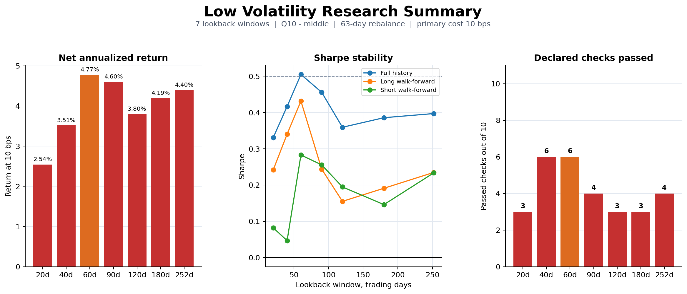
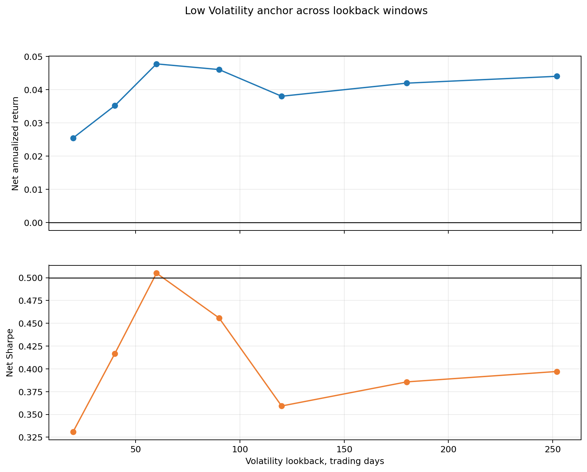
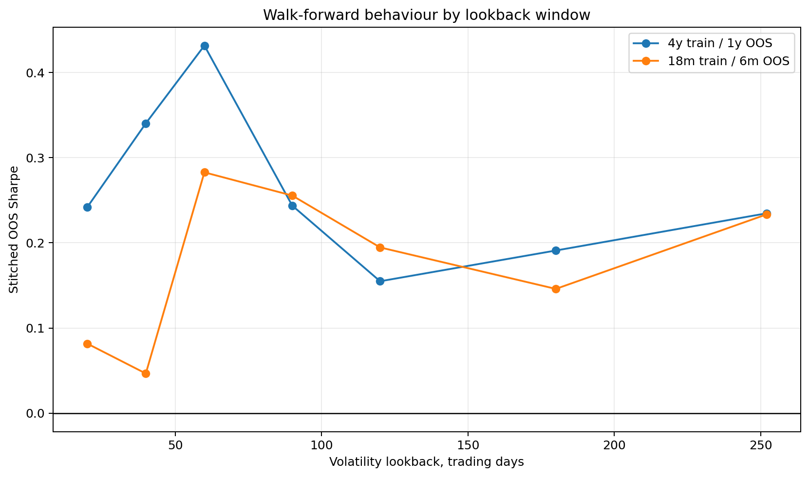
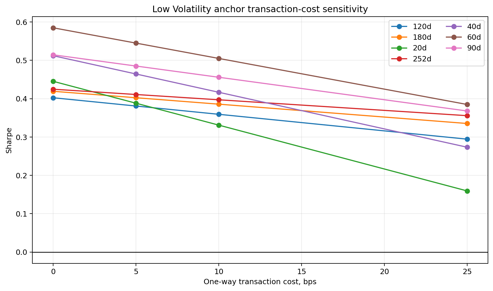
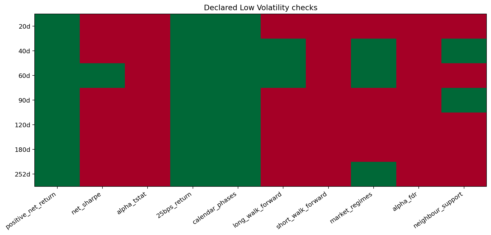

# Low Volatility Deep Dive

## Scope

- Tested lookbacks: `[20, 40, 60, 90, 120, 180, 252]` trading days.
- Fixed anchor: `q10_minus_middle`, beta-neutral, rebalance every `63` days.
- Primary cost: `10` bps.
- The complete portfolio grid is retained for description, but every lookback is judged using the same anchor implementation.
- The anchor was discovered after viewing Layer 4, so this is sensitivity research, not a new untouched test.
- Because the factor is negative volatility, Q10 contains the lowest-volatility stocks.

## Selection-Layer Boundary

The 63-day Selection result described a lower-tail pattern, while the Layer 4 anchor uses the opposite low-volatility Q10 side. This direction was found post-selection and is therefore labelled explicitly rather than presented as prior confirmation.

| factor_key | window | selection_pattern | selection_status |
| --- | --- | --- | --- |
| low_volatility\|20d | 20.0000 | lower_tail | time_unstable_pattern |
| low_volatility\|40d | 40.0000 | lower_tail | time_unstable_pattern |
| low_volatility\|60d | 60.0000 | lower_tail | rejected_by_multiple_testing |
| low_volatility\|90d | 90.0000 | lower_tail | rejected_by_multiple_testing |
| low_volatility\|120d | 120.0000 | lower_tail | rejected_by_multiple_testing |
| low_volatility\|180d | 180.0000 | lower_tail | time_unstable_pattern |
| low_volatility\|252d | 252.0000 | no_stable_structure | no_stable_structure |

## Declared Rules

- Net Sharpe at 10 bps >= `0.5`.
- Alpha HAC t-stat at 10 bps >= `1.96`.
- The same alpha result must survive Benjamini-Hochberg FDR across all seven anchor windows.
- Positive return at both 10 and 25 bps.
- Every tested calendar phase has positive annualized return.
- The long walk-forward anchor has positive return in every reported market-regime state.
- Long walk-forward Sharpe >= `0.25` and positive-period rate >= `0.67`.
- Short walk-forward Sharpe > `0.0` and positive-period rate >= `0.55`.
- At least one adjacent declared lookback must pass the core economic checks.

## Window Results

| window | research_status | net_annualized_return_10bps | net_sharpe_10bps | alpha_hac_tstat_10bps | alpha_bh_q_value_10bps | regression_beta_10bps | net_annualized_return_25bps | maximum_drawdown_10bps | annualized_turnover | long_wf_sharpe | short_wf_sharpe | minimum_regime_annualized_return | neighbour_support_count | passed_declared_checks |
| --- | --- | --- | --- | --- | --- | --- | --- | --- | --- | --- | --- | --- | --- | --- |
| 20.0000 | NOT_SUPPORTED | 0.0254 | 0.3310 | 0.9115 | 0.4787 | 0.0560 | 0.0102 | -0.2307 | 9.9778 | 0.2418 | 0.0817 | -0.0193 | 0.0000 | 3.0000 |
| 40.0000 | NOT_SUPPORTED | 0.0351 | 0.4167 | 1.3112 | 0.4787 | 0.0517 | 0.0214 | -0.1747 | 8.8869 | 0.3403 | 0.0466 | 0.0073 | 1.0000 | 6.0000 |
| 60.0000 | ISOLATED_RESULT | 0.0477 | 0.5050 | 1.6033 | 0.4787 | 0.0677 | 0.0349 | -0.1978 | 8.1908 | 0.4317 | 0.2828 | 0.0186 | 0.0000 | 6.0000 |
| 90.0000 | NOT_SUPPORTED | 0.0460 | 0.4559 | 1.2452 | 0.4787 | 0.1019 | 0.0357 | -0.2398 | 6.5810 | 0.2437 | 0.2555 | -0.0028 | 1.0000 | 4.0000 |
| 120.0000 | NOT_SUPPORTED | 0.0380 | 0.3593 | 0.7085 | 0.4787 | 0.1474 | 0.0296 | -0.3221 | 5.4314 | 0.1549 | 0.1946 | -0.0058 | 0.0000 | 3.0000 |
| 180.0000 | NOT_SUPPORTED | 0.0419 | 0.3857 | 0.7895 | 0.4787 | 0.1550 | 0.0352 | -0.3194 | 4.2836 | 0.1910 | 0.1459 | -0.0032 | 0.0000 | 3.0000 |
| 252.0000 | NOT_SUPPORTED | 0.0440 | 0.3971 | 0.7959 | 0.4787 | 0.1675 | 0.0384 | -0.3234 | 3.5728 | 0.2347 | 0.2334 | 0.0011 | 0.0000 | 4.0000 |

## Benchmarks

| benchmark | annualized_return | annualized_volatility | sharpe | maximum_drawdown |
| --- | --- | --- | --- | --- |
| equal_weight_market | 0.1412 | 0.1812 | 0.7382 | -0.3990 |
| risk_free | 0.0150 | 0.0012 |  | 0.0000 |

## Strongest Full-Grid Implementations

These are descriptive maxima from the searched implementation grid and are not used as independent confirmation.

| factor_key | method | beta_neutral | rebalance_days | annualized_return | sharpe | alpha_hac_tstat | annualized_turnover | maximum_drawdown |
| --- | --- | --- | --- | --- | --- | --- | --- | --- |
| low_volatility\|60d | q10_minus_middle | True | 63.0000 | 0.0477 | 0.5050 | 1.6033 | 8.1908 | -0.1978 |
| low_volatility\|90d | q10_minus_middle | True | 5.0000 | 0.0445 | 0.4633 | 1.7840 | 19.9428 | -0.1882 |
| low_volatility\|90d | q10_minus_middle | True | 21.0000 | 0.0448 | 0.4611 | 1.5748 | 11.0511 | -0.1938 |
| low_volatility\|90d | q10_minus_middle | True | 63.0000 | 0.0460 | 0.4559 | 1.2452 | 6.5810 | -0.2398 |
| low_volatility\|40d | q10_minus_middle | True | 63.0000 | 0.0351 | 0.4167 | 1.3112 | 8.8869 | -0.1747 |
| low_volatility\|180d | q10_minus_middle | True | 5.0000 | 0.0416 | 0.4118 | 1.4120 | 12.1233 | -0.1971 |
| low_volatility\|252d | q10_minus_middle | True | 5.0000 | 0.0408 | 0.4033 | 1.3215 | 9.6033 | -0.2056 |
| low_volatility\|252d | q10_minus_middle | True | 63.0000 | 0.0440 | 0.3971 | 0.7959 | 3.5728 | -0.3234 |
| low_volatility\|120d | q10_minus_middle | True | 5.0000 | 0.0383 | 0.3953 | 1.4411 | 16.0659 | -0.2149 |
| low_volatility\|252d | q10_minus_middle | True | 21.0000 | 0.0408 | 0.3931 | 1.0520 | 5.4594 | -0.2649 |
| low_volatility\|90d | q10_minus_q1 | True | 63.0000 | 0.0571 | 0.3892 | 1.1765 | 6.8516 | -0.3821 |
| low_volatility\|120d | q10_minus_middle | True | 21.0000 | 0.0383 | 0.3877 | 1.1949 | 8.7944 | -0.2495 |
| low_volatility\|180d | q10_minus_middle | True | 63.0000 | 0.0419 | 0.3857 | 0.7895 | 4.2836 | -0.3194 |
| low_volatility\|60d | q10_minus_middle | True | 21.0000 | 0.0349 | 0.3823 | 1.2948 | 14.3027 | -0.2186 |
| low_volatility\|252d | q10_minus_q1 | True | 63.0000 | 0.0561 | 0.3732 | 0.8582 | 3.8454 | -0.4105 |

## Conclusion

No Low Volatility window formed a robust neighbouring plateau under the declared rules.

## Limitations

- Sector exposure status: `NOT_AVAILABLE` — Data System has no point-in-time sector_history.csv. Historical sector exposure was not estimated.
- Candidate and anchor selection used the same historical dataset.
- Yahoo historical availability and residual survivorship bias remain.
- No result from this report is labelled `VALIDATED_ALPHA`.

## Figures

### Window Sensitivity

### Walk Forward Windows

### Cost Sensitivity

### Declared Checks

